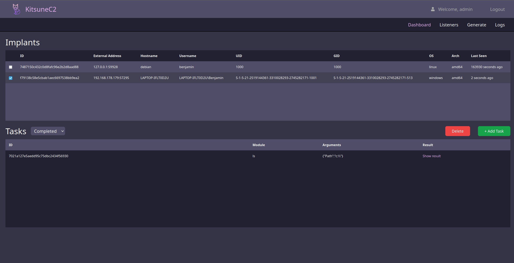
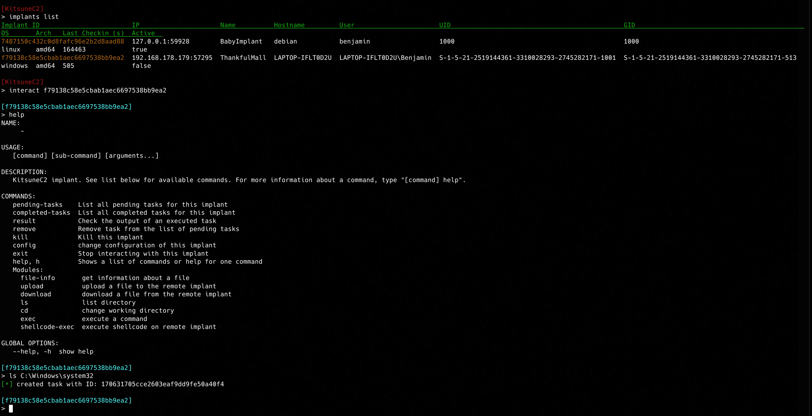

# Kitsune C2
<p align="center">
  
</p>

KitsuneC2 is a pure-go adversary emulation framework that can be used by organisations to perform security testing. The framework also contains a web-UI for interacting with implants. 

## Features
- Dynamic implant generation
- Web interface *and* CLI interface
- In-memory execution of shellcode
- Malleable C2 traffic

## Information
Usage of KitsuneC2 for attacking targets without prior mutual consent is illegal.
Developers assume no liability and are not responsible for any misuse or damage caused by this program. Furthermore, this
project was developed by me in an effort to better understand how C2 frameworks work. In no circumstance is this the best adversary
framework to use for professional engagements. There are way more mature frameworks out there, such as:
- [Covenant](https://github.com/cobbr/Covenant)
- [Sliver](https://github.com/BishopFox/sliver)

To name a few. Feel free to improve this project by submitting a pull-request.

> Known issues: 
> <br> KitsuneC2 Windows server cannot generate linux implants because of lack of Cgo toolchain support

## Installation
KitsuneC2 has both a CLI-interface and a Web-interface. Instructions are different depending on what interface you want.

### Install KitsuneC2 with CLI-interface
Make sure you have **Go** and **GCC** installed and in **PATH**. Go to the [RELEASES] tab and download the server binary for your platform. No extra dependencies are needed, you can run the binary and start your engagement.


### Install KitsuneC2 with Web-interface
The web-interface will run using **docker-compose** and requires a bit more setting up. Currently, *Windows* is **not** supported yet for this mode.
```bash
git clone https://github.com/benji-k/KitsuneC2.git
cd KitsuneC2
pip install -r requirements.txt
python3 web-install.py

Follow the instructions given by the Python script
```


## Screenshots
<p align="center">
  
</p>
<p align="center">
  
</p>