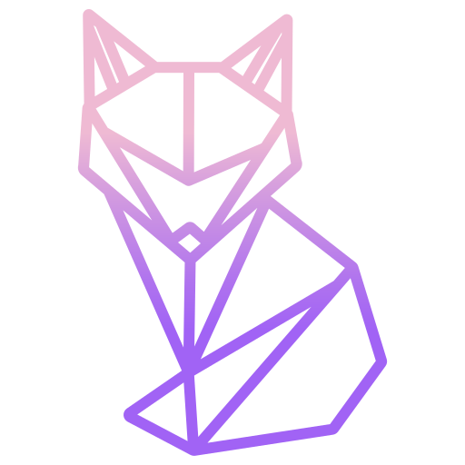

# Kitsune C2
<p align="center">
  
</p>

KitsuneC2 is a pure-go adversary emulation framework that can be used by organisations to perform security testing. The framework also contains a web-UI for interacting with implants. 

## Features
- Dynamic implant generation
- Web interface
- In-memory execution of shellcode
- Malleable C2 traffic

## Information
Usage of KitsuneC2 for attacking targets without prior mutual consent is illegal.
Developers assume no liability and are not responsible for any misuse or damage caused by this program. Furthermore, this
project was developed by me in an effort to better understand how C2 frameworks work. In no circumstance is this the best adversary
framework to use for professional engagements. There are way more mature frameworks out there, such as:
- [Covenant](https://github.com/cobbr/Covenant)
- [Sliver](https://github.com/BishopFox/sliver)

To name a few. Feel free to improve this project by submitting a pull-request.


## Installation
Instructions on how to install **KitsuneC2**
```bash
git clone https://github.com/benji-k/KitsuneC2.git
cd KitsuneC2/kitsuneC2
sudo docker build . -t kitsunec2
```

## Usage
```bash
sudo docker run -it --network=host kitsunec2
```